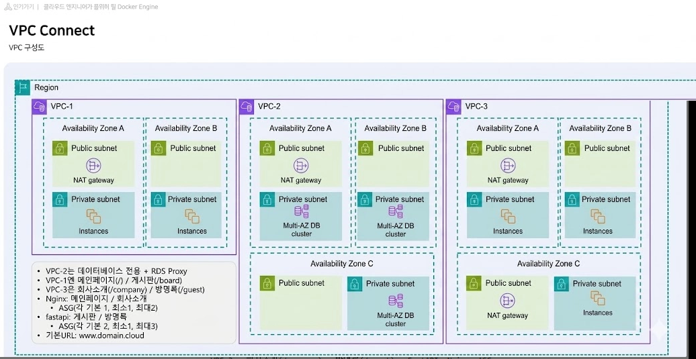

# AWS 멀티 VPC 기반 3-Tier 게시판/방명록 서비스

- **기간**: 2026.4.9 ~ 2026.4.11 (3일)
- **형태**: 개인 프로젝트
- **담당 역할**: 멀티 VPC 네트워크 설계, RDS Proxy 연동, ALB 경로 기반 라우팅 구성

## 개요

FastAPI와 MySQL(Aurora)을 활용한 3-Tier 게시판/방명록 애플리케이션을, VPC 3개로 분리된
멀티 계정형 네트워크 구조 위에 구축했다. 도메인 하나(`www.kkhwan.cloud`)로 들어오는 요청을
경로별로 서로 다른 VPC의 서비스로 라우팅하도록 설계했다.

```
VPC-1   메인페이지(/) + 게시판(/board)      — FastAPI, Nginx, ASG
VPC-2   데이터베이스 전용                   — RDS(Multi-AZ Aurora), RDS Proxy
VPC-3   회사소개(/company) + 방명록(/guest) — FastAPI, Nginx, ASG
```

## 아키텍처

### VPC / 서브넷 구성

| VPC | CIDR | 용도 |
|---|---|---|
| std5-aws-vpc1 | 10.1.0.0/16 | 메인페이지 + 게시판 (FastAPI, Nginx) |
| std5-db-vpc2 | 10.2.0.0/16 | RDS(Aurora Multi-AZ) + RDS Proxy |
| std5-aws-vpc3 | 10.3.0.0/16 | 회사소개 + 방명록 (FastAPI, Nginx) |

각 VPC는 가용영역별 Public/Private 서브넷으로 분리했고, Public 서브넷에는 NAT Gateway를,
Private 서브넷에는 EC2 인스턴스(Nginx/FastAPI)를 배치했다.

### 네트워크 흐름

```
사용자
  ↓ (Route 53: www.kkhwan.cloud)
외부 ALB (std5-lb)
  ├─ "/", "/board"        → VPC-1 내부 ALB → VPC-1 Nginx/FastAPI
  └─ "/company", "/guest" → VPC-3 내부 ALB → VPC-3 Nginx/FastAPI
                                       ↓
                            VPC Peering (1↔2, 2↔3, 1↔3)
                                       ↓
                            VPC-2: RDS Proxy → Aurora MySQL
```


## 핵심 설계 포인트

### 1. VPC 역할 분리 + Peering 기반 DB 접근
DB 전용 VPC(VPC-2)와 애플리케이션 VPC(VPC-1, VPC-3)를 역할별로 분리하고, 세 VPC를
각각 Peering(1↔2, 2↔3, 1↔3)으로 연결해 어느 애플리케이션 VPC에서든 DB VPC에 직접
접근 가능하도록 구성했다. RDS는 Private 서브넷에 배치하고 RDS Proxy를 통해 연결하도록
했다.

### 2. RDS Proxy + Secrets Manager 연동
RDS Proxy 생성 시 인증 방식으로 IAM 역할과 Secrets Manager 보안 암호를 연결했고,
DB 자격증명을 코드에 하드코딩하지 않고 `boto3`로 Secrets Manager에서 조회하도록
구성했다. EC2가 Secrets Manager를 조회할 수 있도록 `SecretsManagerReadWrite`,
`AmazonRDSFullAccess` 정책을 포함한 IAM 역할(`std5-ec2-role`)을 시작 템플릿의
IAM 인스턴스 프로파일로 지정했다.

> **참고**: 애플리케이션 코드(`main.py`)의 DB 연결 `host` 값은 RDS Proxy 엔드포인트가
> 아닌 Aurora 클러스터 엔드포인트(`*.cluster-*.rds.amazonaws.com`)로 되어 있다.
> RDS Proxy 자체는 별도로 생성하고 프록시 엔드포인트로 접속 테스트까지 진행했으나,
> 최종 애플리케이션 코드에는 프록시 엔드포인트 반영이 누락되어 있어 개선이 필요한 부분이다.

### 3. ALB 2단 구조로 경로 기반 라우팅
외부 ALB가 도메인 전체 요청을 받아 `/`, `/board`는 VPC-1 내부 ALB로, `/company`,
`/guest`는 VPC-3 내부 ALB로 전달한다. 내부 ALB는 자체 IP를 갖지 않으므로, 각 내부 ALB의
네트워크 인터페이스 프라이빗 IP를 외부 ALB의 IP 기반 대상 그룹에 등록해 VPC 간 트래픽을
연결했다. 대상 그룹 헬스체크 경로도 서비스 특성에 맞게 개별 설정했다(`/board`, `/guest`) —
FastAPI 코드 특성상 `@app.get("/")`가 없으면 기본 경로 헬스체크가 404로 실패하기 때문이다.

### 4. 한글 인코딩 및 문자셋 일관성 확보
Nginx `/etc/nginx/conf.d/charset.conf`에 `charset utf-8`을 명시적으로 설정하고,
MySQL 데이터베이스도 `utf8mb4`(`utf8mb4_unicode_ci`)로 통일해 프론트엔드-백엔드-DB
전 구간의 한글 처리를 일치시켰다.

## 트러블슈팅

### 1) RDS Proxy 인증 실패
- **문제**: RDS Proxy가 Secrets Manager의 DB 자격 증명을 읽어오지 못해 연결이 계속
  실패했다.
- **해결**: IAM 역할에 `secretsmanager:GetSecretValue` 권한이 누락되어 있던 것이 원인.
  해당 권한을 추가해 해결했다.

### 2) ALB 리스너 규칙 우선순위 오설정
- **문제**: `/board` 경로로 요청해도 계속 기본 규칙(nginx 대상그룹)으로 라우팅됐다.
- **원인**: ALB 리스너 규칙은 숫자가 낮을수록 먼저 평가되는데, `/board` 규칙의
  우선순위를 기본 규칙(`/`)보다 뒤에 둔 것이 원인이었다.
- **해결**: `/board` 규칙을 우선순위 1번으로, 나머지(`/`)를 2번으로 재조정했다.
  (VPC-3도 동일하게 `/guest`, `/company` 순서로 우선순위 조정)

### 3) 한글 깨짐
- **문제**: Nginx로 서빙한 HTML/API 응답의 한글이 깨졌다.
- **원인**: Nginx 기본 설정에 charset이 지정돼 있지 않았다.
- **해결**: `/etc/nginx/conf.d/charset.conf`에 `charset utf-8;`을 추가해 해결했다.

## 결과

- `www.kkhwan.cloud` — 메인 페이지 + 실시간 게시판(VPC-1) / 최근 방명록(VPC-3) 노출
- `www.kkhwan.cloud/company` — 회사 소개 페이지(VPC-3)
- `www.kkhwan.cloud/board` — 게시판 API (JSON)
- `www.kkhwan.cloud/guest` — 방명록 API (JSON)

## 폴더 구조

```
.
├── README.md
├── images/
│   └── vpc-architecture.png  
├── vpc1-nginx/
│   └── userdata.sh        # VPC-1 Nginx 시작 템플릿 (index.html, 메인 대시보드)
├── vpc1-fastapi/
│   ├── main.py             # VPC-1 FastAPI (/board)
│   ├── fastapi.service     # systemd 유닛 파일
│   └── userdata.sh         # VPC-1 FastAPI 시작 템플릿 전체 스크립트
├── vpc3-nginx/
│   └── userdata.sh         # VPC-3 Nginx 시작 템플릿 (company.html)
├── vpc3-fastapi/
│   ├── main.py             # VPC-3 FastAPI (/guest)
│   ├── fastapi.service
│   └── userdata.sh
└── db/
    └── schema.sql           # board, guest 테이블 + 테스트 데이터
```


